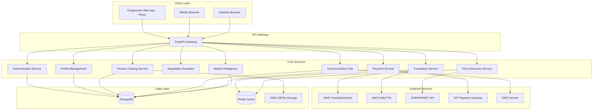

# Design Document: Multilingual Mandi Platform

## Overview

The Multilingual Mandi platform is a comprehensive real-time linguistic bridge system designed to connect Indian vendors and buyers across language barriers. The platform leverages modern web technologies, AI-powered translation services, and market intelligence to create an inclusive digital marketplace that embodies the Viksit Bharat vision.

The system architecture follows a microservices approach with a React-based Progressive Web App frontend, FastAPI backend services, and MongoDB for data persistence. The platform integrates with external AI services for translation, speech processing, and market data aggregation to provide a seamless multilingual trading experience.

## Architecture

### High-Level Architecture



### Technology Stack

**Frontend:**
- React 18 with TypeScript for type safety
- TailwindCSS for responsive, culturally-appropriate styling
- Vite for fast development and optimized builds
- PWA capabilities with service workers for offline functionality
- Web Speech API for voice input/output
- WebRTC for real-time communication

**Backend:**
- FastAPI with Python 3.11+ for high-performance API services
- Pydantic for data validation and serialization
- AsyncIO for concurrent request handling
- JWT for secure authentication
- WebSocket support for real-time features

**Database:**
- MongoDB for flexible document storage
- Redis for caching and session management
- GridFS for file storage (product images, documents)

**AI & External Services:**
- Primary: AWS Translate for text translation (supports Hindi, Bengali, Tamil, Telugu, Gujarati, Kannada, Malayalam, Marathi, Punjabi)
- Fallback: Google Gemini API for enhanced Indian language support
- AWS Polly for text-to-speech in multiple Indian languages
- Web Speech API for speech-to-text input
- AGMARKNET integration for real-time market data

## Components and Interfaces

### 1. Translation Engine Component

**Purpose:** Handles all multilingual communication and content translation

**Key Interfaces:**
```python
class TranslationService:
    async def translate_text(
        self, 
        text: str, 
        source_lang: str, 
        target_lang: str
    ) -> TranslationResult
    
    async def detect_language(self, text: str) -> LanguageDetection
    
    async def text_to_speech(
        self, 
        text: str, 
        language: str, 
        voice_type: str = "standard"
    ) -> AudioResponse
    
    async def speech_to_text(
        self, 
        audio_data: bytes, 
        language: str
    ) -> SpeechRecognitionResult
```

**Supported Languages:**
- Hindi (hi), English (en), Tamil (ta), Telugu (te), Bengali (bn)
- Marathi (mr), Gujarati (gu), Kannada (kn), Malayalam (ml)
- Punjabi (pa), Odia (or), Assamese (as), Urdu (ur)

**Implementation Strategy:**
- Primary translation via AWS Translate API with custom terminology for business terms
- Fallback to Google Gemini API for enhanced dialect support
- Local caching of common translations to reduce API calls
- Context-aware translation maintaining business terminology consistency

### 2. Price Discovery Engine Component

**Purpose:** Aggregates and analyzes market prices from multiple sources

**Key Interfaces:**
```python
class PriceDiscoveryService:
    async def get_current_prices(
        self, 
        commodity: str, 
        location: str, 
        radius_km: int = 50
    ) -> List[PriceData]
    
    async def get_price_trends(
        self, 
        commodity: str, 
        period: TimePeriod
    ) -> PriceTrendAnalysis
    
    async def predict_seasonal_prices(
        self, 
        commodity: str, 
        forecast_days: int
    ) -> PriceForecast
    
    async def compare_market_prices(
        self, 
        commodity: str, 
        markets: List[str]
    ) -> MarketComparison
```

**Data Sources:**
- AGMARKNET API for official mandi prices
- Historical price database for trend analysis
- Weather API integration for price impact prediction
- MSP database for agricultural products

**Analytics Features:**
- Machine learning models for price prediction using historical data
- Seasonal pattern recognition for agricultural commodities
- Quality-based price differentiation
- Location-based price variation analysis

### 3. Negotiation Assistant Component

**Purpose:** Provides AI-powered negotiation guidance and suggestions

**Key Interfaces:**
```python
class NegotiationAssistant:
    async def get_price_recommendation(
        self, 
        commodity: str, 
        quantity: float, 
        quality_grade: str,
        market_context: MarketContext
    ) -> PriceRecommendation
    
    async def generate_counter_offer(
        self, 
        current_offer: Offer, 
        market_data: MarketData,
        negotiation_history: List[NegotiationStep]
    ) -> CounterOfferSuggestion
    
    async def get_cultural_guidance(
        self, 
        buyer_region: str, 
        seller_region: str
    ) -> CulturalNegotiationTips
```

**AI Features:**
- Historical negotiation pattern analysis
- Cultural sensitivity recommendations
- Bulk discount calculations
- Seasonal demand factor integration
- Fair price range determination

### 4. Vendor Profile System Component

**Purpose:** Manages vendor identity, credibility, and transaction history

**Key Interfaces:**
```python
class VendorProfileService:
    async def create_vendor_profile(
        self, 
        vendor_data: VendorRegistration
    ) -> VendorProfile
    
    async def verify_credentials(
        self, 
        vendor_id: str, 
        documents: List[Document]
    ) -> VerificationResult
    
    async def update_credibility_score(
        self, 
        vendor_id: str, 
        transaction: Transaction
    ) -> CredibilityUpdate
    
    async def get_vendor_analytics(
        self, 
        vendor_id: str
    ) -> VendorAnalytics
```

**Credibility Factors:**
- Transaction completion rate
- Customer ratings and reviews
- Response time to inquiries
- Quality complaint resolution
- Government license verification status

### 5. Smart Product Catalog Component

**Purpose:** AI-powered product recognition, categorization, and quality assessment

**Key Interfaces:**
```python
class ProductCatalogService:
    async def analyze_product_image(
        self, 
        image_data: bytes
    ) -> ProductAnalysis
    
    async def estimate_quantity(
        self, 
        images: List[bytes], 
        product_type: str
    ) -> QuantityEstimate
    
    async def assess_quality(
        self, 
        product_images: List[bytes], 
        product_category: str
    ) -> QualityAssessment
    
    async def detect_freshness(
        self, 
        image_data: bytes, 
        product_type: str
    ) -> FreshnessIndicator
```

**AI Capabilities:**
- Computer vision for product identification
- Quality grading based on visual characteristics
- Quantity estimation using object detection
- Freshness detection for perishable goods
- Barcode/QR code recognition for packaged items

## Data Models

### Core Data Structures

```python
# User and Authentication Models
class User(BaseModel):
    user_id: str
    email: str
    phone: str
    preferred_language: str
    user_type: UserType  # VENDOR, BUYER, BOTH
    profile: Union[VendorProfile, BuyerProfile]
    created_at: datetime
    last_active: datetime

class VendorProfile(BaseModel):
    business_name: str
    business_type: str
    specializations: List[str]
    location: Location
    credentials: List[Credential]
    credibility_score: float
    verification_status: VerificationStatus
    transaction_stats: TransactionStats

# Product and Catalog Models
class Product(BaseModel):
    product_id: str
    vendor_id: str
    name: str
    category: str
    subcategory: str
    description: Dict[str, str]  # Multi-language descriptions
    images: List[str]
    quality_grade: QualityGrade
    quantity_available: float
    unit: str
    price_per_unit: float
    location: Location
    freshness_indicator: Optional[FreshnessLevel]
    certifications: List[str]

# Communication and Translation Models
class Conversation(BaseModel):
    conversation_id: str
    participants: List[str]
    language_preferences: Dict[str, str]  # user_id -> language
    messages: List[Message]
    negotiation_context: Optional[NegotiationContext]
    created_at: datetime
    updated_at: datetime

class Message(BaseModel):
    message_id: str
    sender_id: str
    original_text: str
    original_language: str
    translations: Dict[str, str]  # language -> translated_text
    message_type: MessageType  # TEXT, VOICE, IMAGE, OFFER
    timestamp: datetime
    metadata: Optional[Dict]

# Market Intelligence Models
class PriceData(BaseModel):
    commodity: str
    market_name: str
    location: Location
    price_min: float
    price_max: float
    price_modal: float
    quality_grade: str
    date: date
    source: str  # AGMARKNET, MANUAL, PREDICTED

class MarketTrend(BaseModel):
    commodity: str
    time_period: str
    price_points: List[PricePoint]
    trend_direction: TrendDirection
    volatility_index: float
    seasonal_factors: List[SeasonalFactor]
    prediction_confidence: float

# Transaction Models
class Transaction(BaseModel):
    transaction_id: str
    buyer_id: str
    vendor_id: str
    product_id: str
    quantity: float
    agreed_price: float
    total_amount: float
    payment_status: PaymentStatus
    delivery_status: DeliveryStatus
    negotiation_history: List[NegotiationStep]
    created_at: datetime
    completed_at: Optional[datetime]
```

### Database Schema Design

**MongoDB Collections:**

1. **users** - User profiles and authentication data
2. **vendors** - Vendor-specific information and credentials
3. **products** - Product catalog with multilingual support
4. **conversations** - Chat history with translations
5. **transactions** - Transaction records and history
6. **market_data** - Price information and trends
7. **negotiations** - Negotiation sessions and AI recommendations
8. **translations_cache** - Cached translations for performance

**Redis Cache Structure:**
- `price:{commodity}:{location}` - Current price data
- `translation:{hash}` - Cached translations
- `session:{user_id}` - User session data
- `market_trends:{commodity}` - Trending market data

Now I need to use the prework tool to analyze the acceptance criteria before writing the Correctness Properties section:

<function_calls>
<invoke name="prework">
<parameter name="featureName">multilingual-mandi

## Correctness Properties

*A property is a characteristic or behavior that should hold true across all valid executions of a system—essentially, a formal statement about what the system should do. Properties serve as the bridge between human-readable specifications and machine-verifiable correctness guarantees.*

Based on the prework analysis, the following properties have been identified to validate the system's correctness across all supported scenarios:

### Translation Engine Properties

**Property 1: Comprehensive Language Support**
*For any* text input in any of the 22 supported Indian languages, the Translation_Engine should successfully process and translate it to any other supported language with maintained semantic meaning.
**Validates: Requirements 1.1, 1.2**

**Property 2: Translation Accuracy Consistency**
*For any* business-related terminology in the supported languages, the Translation_Engine should maintain at least 85% translation accuracy when measured against expert human translations.
**Validates: Requirements 1.6**

**Property 3: Voice Processing Round Trip**
*For any* voice input in a supported language, the complete pipeline of speech-to-text, translation, and text-to-speech should produce comprehensible output that preserves the original meaning.
**Validates: Requirements 1.5**

**Property 4: Context Preservation During Language Switching**
*For any* conversation where users switch languages mid-conversation, the Translation_Engine should maintain conversation context and provide coherent translations without losing semantic continuity.
**Validates: Requirements 1.3**

**Property 5: Dialect Recognition Consistency**
*For any* regional dialect variation within supported languages, the Translation_Engine should recognize and adapt to the dialect while maintaining translation quality.
**Validates: Requirements 1.4**

### Price Discovery Engine Properties

**Property 6: Multi-Source Price Aggregation**
*For any* commodity price query, the Price_Discovery_Engine should return data aggregated from multiple mandi sources across India, ensuring comprehensive market coverage.
**Validates: Requirements 2.1**

**Property 7: Data Freshness Guarantee**
*For any* price query, the Price_Discovery_Engine should provide data that is no more than 5 minutes older than the latest available market update.
**Validates: Requirements 2.2**

**Property 8: Historical Data Completeness**
*For any* commodity, the Price_Discovery_Engine should provide complete historical price trends for the requested time periods (30 days, 6 months, 1 year) without gaps in data.
**Validates: Requirements 2.3**

**Property 9: Geographic Price Filtering Accuracy**
*For any* location-based price search, all returned results should be within the specified radius (default 50km) of the query location.
**Validates: Requirements 2.5**

**Property 10: MSP Integration Correctness**
*For any* agricultural product with an established MSP, the Price_Discovery_Engine should correctly identify and highlight when market prices fall below the MSP threshold.
**Validates: Requirements 2.6**

**Property 11: Quality-Based Price Categorization**
*For any* commodity, prices should be correctly categorized by quality grades (premium, standard, below-standard) with consistent classification criteria.
**Validates: Requirements 2.7**

### Negotiation Assistant Properties

**Property 12: Market-Based Price Recommendations**
*For any* negotiation scenario, the Negotiation_Assistant should provide price recommendations that fall within the current market range for the specific commodity, quality, and location.
**Validates: Requirements 3.1**

**Property 13: Comprehensive Counter-Offer Generation**
*For any* negotiation context, counter-offer suggestions should appropriately consider historical patterns, quality assessment, bulk discounts, and seasonal dynamics.
**Validates: Requirements 3.2, 3.4**

**Property 14: Cultural Guidance Provision**
*For any* negotiation between parties from different regions, the Negotiation_Assistant should provide appropriate cultural etiquette guidance specific to the regional combination.
**Validates: Requirements 3.3**

**Property 15: Fair Price Range Indication**
*For any* price offer, the system should correctly categorize it as within or outside fair market range using consistent criteria based on current market data.
**Validates: Requirements 3.5**

### Vendor Profile System Properties

**Property 16: Verification Requirement Enforcement**
*For any* vendor profile creation attempt, the system should require and validate government-issued ID verification before allowing profile activation.
**Validates: Requirements 4.1**

**Property 17: Multilingual Rating System**
*For any* completed transaction, buyers should be able to submit ratings and reviews in their preferred language, and these should be properly stored and displayed.
**Validates: Requirements 4.2**

**Property 18: Credibility Score Calculation Consistency**
*For any* vendor, the credibility score should be calculated using the same algorithm considering transaction history, ratings, and dispute resolution outcomes.
**Validates: Requirements 4.3**

**Property 19: License Verification and Display**
*For any* vendor with government licenses or certifications, these should be properly verified and displayed with current validation status.
**Validates: Requirements 4.4**

**Property 20: Specialization Tag Accuracy**
*For any* vendor with product specializations, appropriate tags (organic, certified, premium quality) should be displayed based on verified credentials.
**Validates: Requirements 4.5**

### Smart Product Catalog Properties

**Property 21: Image Recognition Accuracy**
*For any* product image upload, the Product_Catalog should correctly identify and categorize the product with consistent classification across similar items.
**Validates: Requirements 5.1**

**Property 22: Quality Assessment Consistency**
*For any* product images of the same type and quality, the AI quality assessment should assign consistent quality grades.
**Validates: Requirements 5.2**

**Property 23: Quantity Estimation Accuracy**
*For any* product with known quantities, the computer vision quantity estimation should be within an acceptable margin of error (±10%) of the actual quantity.
**Validates: Requirements 5.3**

**Property 24: Freshness Detection for Perishables**
*For any* perishable product image, the system should provide appropriate freshness indicators based on visual analysis.
**Validates: Requirements 5.4**

**Property 25: Barcode Recognition Functionality**
*For any* clear barcode or QR code image, the system should successfully scan and identify the corresponding product information.
**Validates: Requirements 5.5**

**Property 26: Manual Override Capability**
*For any* AI-generated classification or quality assessment, users should be able to successfully override the automatic determination with manual input.
**Validates: Requirements 5.6**

### Communication Hub Properties

**Property 27: Real-Time Translation in Chat**
*For any* message sent in a supported language, the Communication_Hub should provide real-time translation to all participants' preferred languages.
**Validates: Requirements 6.1**

**Property 28: Multi-Modal Communication Support**
*For any* communication session (text, voice, video), the system should provide appropriate translation and interpretation services.
**Validates: Requirements 6.2, 6.3**

**Property 29: Broadcast Message Delivery**
*For any* broadcast message, all intended recipients should receive the message in their preferred language.
**Validates: Requirements 6.4**

**Property 30: Group Negotiation Functionality**
*For any* bulk order discussion, the system should successfully create and manage group negotiation rooms with multiple participants.
**Validates: Requirements 6.5**

**Property 31: Conversation History Preservation**
*For any* conversation, the system should maintain complete history including both original messages and translations for all participants.
**Validates: Requirements 6.6**

### Payment System Properties

**Property 32: Payment Method Integration**
*For any* transaction, all specified payment methods (UPI, digital wallets, cards) should be available and functional.
**Validates: Requirements 7.1**

**Property 33: Multilingual Invoice Generation**
*For any* completed transaction, invoices should be generated in the user's preferred language with accurate translation of all terms.
**Validates: Requirements 7.2**

**Property 34: Transaction Tracking and Coordination**
*For any* order, the system should provide complete tracking information and delivery coordination capabilities.
**Validates: Requirements 7.3**

**Property 35: Escrow Service Availability**
*For any* high-value transaction above the defined threshold, escrow services should be offered and function correctly.
**Validates: Requirements 7.4**

**Property 36: Credit Terms and Scheduling**
*For any* established trading relationship, the system should support credit terms and payment scheduling functionality.
**Validates: Requirements 7.5**

**Property 37: Transaction Record Maintenance**
*For any* completed transaction, comprehensive records should be maintained for tax and accounting purposes with proper data retention.
**Validates: Requirements 7.6**

### Market Intelligence Properties

**Property 38: AGMARKNET Integration Accuracy**
*For any* commodity with AGMARKNET data, the Market_Intelligence_Dashboard should display current and accurate daily mandi rates.
**Validates: Requirements 8.1**

**Property 39: Demand Forecasting Reliability**
*For any* commodity with sufficient historical data, demand forecasts should achieve reasonable accuracy when compared to actual demand patterns.
**Validates: Requirements 8.2**

**Property 40: Weather Impact Prediction**
*For any* weather condition that historically impacts commodity prices, the system should provide appropriate price impact predictions.
**Validates: Requirements 8.3**

**Property 41: Seasonal and Festival Alert System**
*For any* relevant seasonal or festival period, the system should provide timely alerts about demand changes to affected users.
**Validates: Requirements 8.4**

**Property 42: Export-Import Price Influence Display**
*For any* commodity affected by international trade, the system should display relevant export-import price influences on domestic markets.
**Validates: Requirements 8.5**

**Property 43: Personalized Insights Generation**
*For any* user with sufficient trading history, the system should provide insights tailored to their specific patterns and preferences.
**Validates: Requirements 8.6**

### Platform Infrastructure Properties

**Property 44: Cross-Platform PWA Functionality**
*For any* major browser or mobile device, the Progressive Web App should function correctly with consistent user experience.
**Validates: Requirements 11.1**

**Property 45: Responsive Design Adaptation**
*For any* screen size or device orientation, the interface should adapt appropriately while maintaining usability.
**Validates: Requirements 11.2**

**Property 46: Cross-Device Data Synchronization**
*For any* user data change on one device, the same data should be synchronized and available on all other devices within a reasonable time frame.
**Validates: Requirements 11.3**

**Property 47: Low-Bandwidth Performance Optimization**
*For any* network connection simulating 2G/3G speeds, the platform should maintain acceptable performance and functionality.
**Validates: Requirements 11.5**

**Property 48: Offline Functionality Preservation**
*For any* essential platform function, offline mode should provide access to cached data and core functionality when internet connectivity is unavailable.
**Validates: Requirements 11.6**

### Accessibility and Safety Properties

**Property 49: Voice Interface Accessibility**
*For any* major platform function, users should be able to access and complete the task using voice commands alone.
**Validates: Requirements 9.1**

**Property 50: Offline Mode Essential Functions**
*For any* critical platform operation, offline mode should provide access to essential functionality even without internet connectivity.
**Validates: Requirements 9.3**

**Property 51: SMS Alert Delivery**
*For any* critical system event, SMS alerts should be successfully delivered to users who have opted for SMS notifications.
**Validates: Requirements 9.4**

**Property 52: Fraud Detection Effectiveness**
*For any* simulated suspicious activity pattern, the fraud detection algorithms should identify and flag the activity appropriately.
**Validates: Requirements 10.1**

**Property 53: Dispute Resolution Process**
*For any* dispute raised by users, the structured dispute resolution system should provide appropriate escalation and resolution pathways.
**Validates: Requirements 10.2**

**Property 54: Data Encryption Compliance**
*For any* sensitive user data, end-to-end encryption should be properly implemented during transmission and storage.
**Validates: Requirements 10.6**

### Cultural Integration Properties

**Property 55: Vernacular Typography Support**
*For any* supported regional language, text should display correctly with appropriate fonts and character rendering.
**Validates: Requirements 12.2**

**Property 56: Local Vendor Promotion**
*For any* search or recommendation scenario, local vendors should receive appropriate visibility and highlighting in accordance with 'Vocal for Local' principles.
**Validates: Requirements 12.3**

**Property 57: Digital Transaction Enablement**
*For any* small trader, the platform should successfully enable digital transaction completion regardless of their technical expertise level.
**Validates: Requirements 12.4**

**Property 58: Urban-Rural Connection Facilitation**
*For any* rural vendor and urban buyer combination, the platform should successfully facilitate connection and transaction completion.
**Validates: Requirements 12.5**

**Property 59: Regional Language Content Creation**
*For any* supported regional language, users should be able to create and consume content (product descriptions, reviews, messages) in that language.
**Validates: Requirements 12.6**

## Error Handling

The platform implements comprehensive error handling across all components:

### Translation Service Error Handling
- **Service Unavailability**: Fallback from AWS Translate to Google Gemini API
- **Language Detection Failure**: Default to English with user confirmation
- **Translation Quality Issues**: Confidence scoring with manual override options
- **Voice Processing Errors**: Graceful degradation to text-only mode

### Price Discovery Error Handling
- **AGMARKNET API Failures**: Use cached data with staleness indicators
- **Data Inconsistencies**: Cross-validation between multiple sources
- **Prediction Model Failures**: Fallback to historical averages
- **Network Connectivity Issues**: Offline mode with last-known prices

### Communication Error Handling
- **Real-time Translation Failures**: Queue messages for retry with notification
- **Voice Call Interruptions**: Automatic reconnection with context preservation
- **Group Session Management**: Graceful handling of participant disconnections
- **Message Delivery Failures**: Retry mechanisms with delivery confirmations

### Payment System Error Handling
- **Gateway Failures**: Multiple payment provider fallbacks
- **Transaction Timeouts**: Automatic status checking and user notification
- **Escrow Service Issues**: Manual intervention triggers with admin alerts
- **Invoice Generation Errors**: Retry with simplified formatting fallback

### Data Consistency Error Handling
- **Database Connection Issues**: Read replicas and connection pooling
- **Synchronization Failures**: Conflict resolution with user notification
- **Cache Invalidation**: Automatic refresh with background updates
- **File Upload Failures**: Chunked upload with resume capability

## Testing Strategy

The testing approach combines unit testing for specific functionality with property-based testing for comprehensive validation across all input scenarios.

### Property-Based Testing Implementation

**Framework Selection**: 
- **Python Backend**: Use Hypothesis library for property-based testing
- **JavaScript Frontend**: Use fast-check library for property-based testing
- **Integration Tests**: Custom property generators for end-to-end scenarios

**Test Configuration**:
- Minimum 100 iterations per property test to ensure statistical significance
- Custom generators for Indian language text, commodity data, and user scenarios
- Shrinking enabled to find minimal failing examples
- Parallel execution for performance optimization

**Property Test Examples**:

```python
# Translation Engine Property Test
@given(
    source_text=indian_language_text(),
    source_lang=sampled_from(SUPPORTED_LANGUAGES),
    target_lang=sampled_from(SUPPORTED_LANGUAGES)
)
def test_translation_round_trip_consistency(source_text, source_lang, target_lang):
    """Feature: multilingual-mandi, Property 1: Comprehensive Language Support"""
    assume(source_lang != target_lang)
    
    # Translate from source to target
    translated = translation_service.translate(source_text, source_lang, target_lang)
    
    # Translate back to source
    back_translated = translation_service.translate(translated, target_lang, source_lang)
    
    # Semantic similarity should be maintained
    similarity_score = calculate_semantic_similarity(source_text, back_translated)
    assert similarity_score > 0.7, f"Translation lost semantic meaning: {similarity_score}"

# Price Discovery Property Test
@given(
    commodity=commodity_name(),
    location=indian_location(),
    radius_km=integers(min_value=10, max_value=100)
)
def test_geographic_price_filtering(commodity, location, radius_km):
    """Feature: multilingual-mandi, Property 9: Geographic Price Filtering Accuracy"""
    prices = price_discovery_service.get_prices_in_radius(commodity, location, radius_km)
    
    for price_data in prices:
        distance = calculate_distance(location, price_data.location)
        assert distance <= radius_km, f"Price data outside radius: {distance}km > {radius_km}km"
```

### Unit Testing Strategy

**Coverage Requirements**:
- Minimum 90% code coverage for all service modules
- 100% coverage for critical payment and security functions
- Edge case testing for all user input validation
- Error condition testing for all external service integrations

**Test Categories**:

1. **Component Unit Tests**:
   - Individual service method testing
   - Data model validation testing
   - API endpoint response testing
   - Database operation testing

2. **Integration Tests**:
   - Service-to-service communication testing
   - External API integration testing
   - Database transaction testing
   - Authentication and authorization testing

3. **End-to-End Tests**:
   - Complete user journey testing
   - Cross-browser compatibility testing
   - Mobile device testing
   - Performance and load testing

4. **Security Tests**:
   - Input validation and sanitization testing
   - Authentication bypass testing
   - Data encryption verification testing
   - API rate limiting testing

### Test Data Management

**Synthetic Data Generation**:
- Realistic Indian names, addresses, and phone numbers
- Commodity price data based on historical patterns
- Multi-language content generation for translation testing
- Vendor profile data with various specializations

**Test Environment Setup**:
- Isolated test databases with realistic data volumes
- Mock external services (AGMARKNET, payment gateways)
- Simulated network conditions for performance testing
- Multi-language test content validation

### Continuous Testing Pipeline

**Automated Testing Stages**:
1. **Pre-commit**: Unit tests and linting
2. **Pull Request**: Full test suite including property tests
3. **Staging Deployment**: Integration and end-to-end tests
4. **Production Monitoring**: Continuous property validation

**Performance Testing**:
- Load testing with realistic Indian user patterns
- Network latency simulation for rural connectivity
- Memory usage monitoring for mobile devices
- API response time validation under load

This comprehensive testing strategy ensures that the Multilingual Mandi platform maintains high quality and reliability while serving diverse users across India's linguistic and geographic landscape.